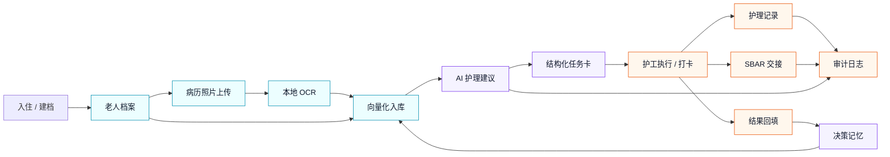
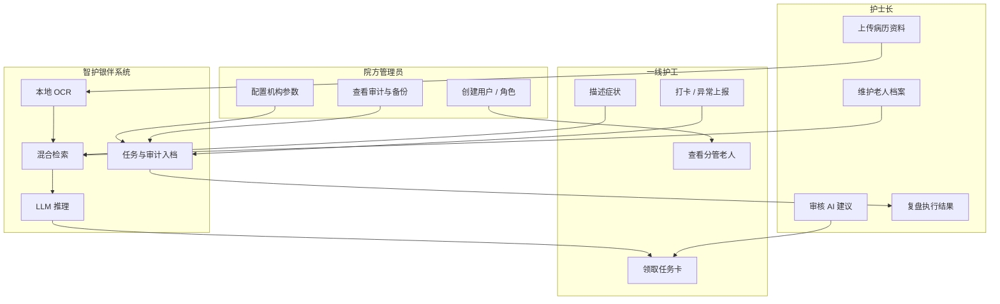
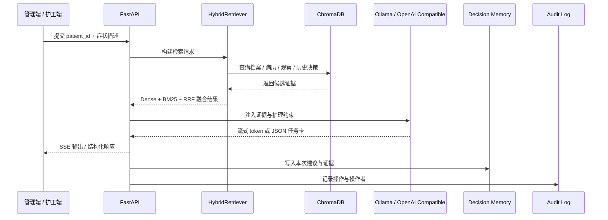
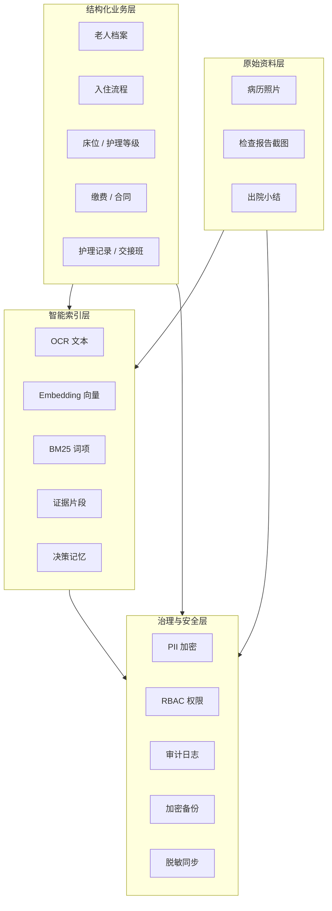
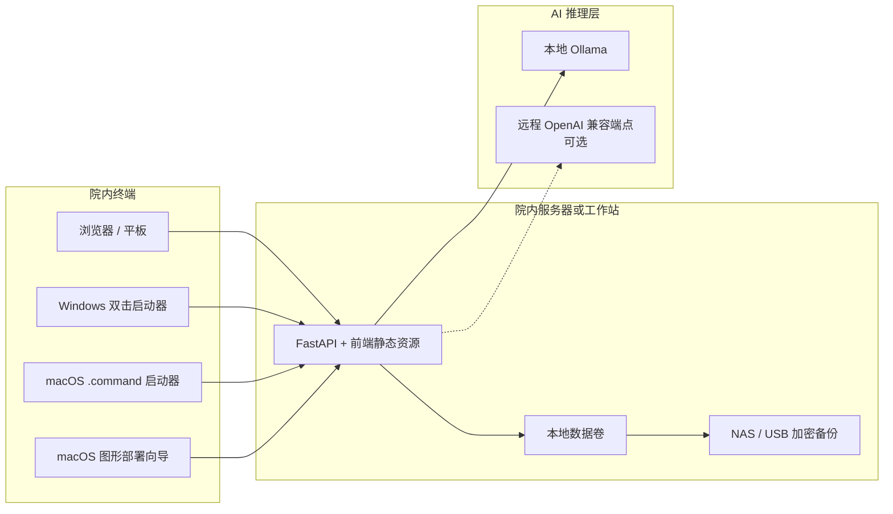
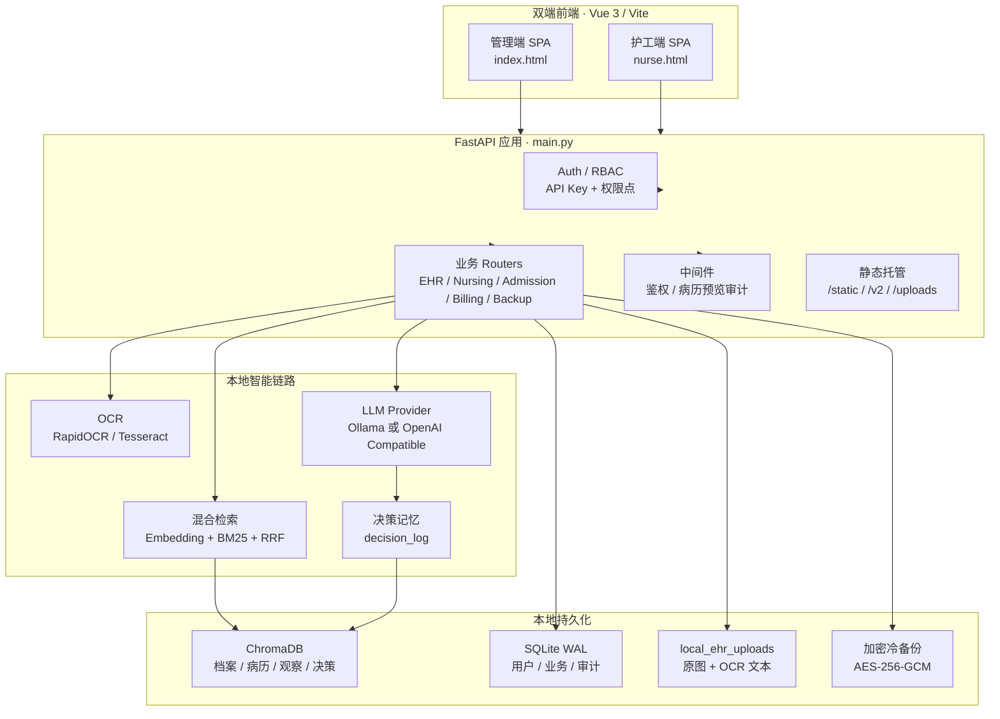

<h1 align="center">智护银伴 · ZhiHu YinBan</h1>

<p align="center">
  <b>面向养老机构的本地优先 AI 护理运营系统</b><br>
  把老人档案、病历照片、护理记录、AI 决策、任务打卡、缴费与审计放进同一个可部署、可追溯、可离线运行的系统。
</p>

<p align="center">
  <b>简体中文</b> | <a href="./README.en.md">English</a>
</p>

<p align="center">
  
  
  
  
  
  
  
  
</p>

---

## 目录

- [项目定位](#项目定位)
- [核心能力](#核心能力)
- [产品界面](#产品界面)
- [业务图谱](#业务图谱)
- [系统架构](#系统架构)
- [快速开始](#快速开始)
- [配置说明](#配置说明)
- [数据安全与合规边界](#数据安全与合规边界)
- [API 概览](#api-概览)
- [项目结构](#项目结构)
- [开发与测试](#开发与测试)
- [部署与运维](#部署与运维)
- [项目边界](#项目边界)
- [路线图](#路线图)
- [许可证](#许可证)

---

## 项目定位

养老机构的信息化通常卡在三个现实问题上：

1. 老人档案、病历照片、交接班、护理记录和收费数据分散在纸面、Excel、聊天软件和本地文件夹里。
2. 一线护工需要的是可执行任务，不是大段 AI 生成文字；护士长需要的是可审计、可复盘的闭环。
3. 医疗和照护数据高度敏感，很多机构不能接受“先上云再智能”的 SaaS 方案。

**智护银伴** 的设计目标是提供一套本地优先的养老护理工作台：

- 院内数据默认落在本机或院内服务器。
- AI 推理优先使用本地 Ollama，也支持 OpenAI 兼容远程端点。
- 病历照片 OCR、向量检索、护理建议、任务卡、审计日志和备份放在同一条业务链路里。
- 管理端面向院方运营与护士长，护工端面向平板/手机上的一线巡房。

它不是一个孤立的 RAG demo，也不是单页宣传站。它是一套能落地到试点环境的本地应用系统。

---

## 核心能力

### 1. 老人档案与病历资料

| 能力 | 说明 |
|---|---|
| 老人基础档案 | 支持新增、编辑、删除、搜索、详情查看与 PDF 导出 |
| 病历照片上传 | 上传病历、检查报告、出院小结等图片资料 |
| 本地 OCR | RapidOCR / Tesseract 识别，OCR 文本和原图都留在本地 |
| 向量化入库 | 档案、病历、观察记录、AI 决策记忆写入 ChromaDB |
| PII 加密 | 姓名、身份证、联系人、床位等高敏字段写入前加密 |

### 2. AI 护理决策

| 能力 | 说明 |
|---|---|
| 混合检索 | Dense embedding + BM25 + RRF 融合，适配中文短词和病症关键词 |
| 证据引用 | 护理建议输出时带证据编号，便于追溯到档案或病历片段 |
| SSE 流式输出 | 管理端实时看到 AI 生成过程 |
| 决策记忆 | 每次 AI 建议写回 `decision_log`，下次同一老人查询时可作为历史证据 |
| 结果回填 | 支持 effective / partial / ineffective 等执行结果闭环 |

### 3. 护理任务卡

AI 不只返回自然语言建议，而是生成结构化任务卡：

- 立即执行任务
- 复测/观察计划
- 禁止事项
- 风险等级
- SBAR 交接摘要
- 任务打卡与异常记录
- 自动归档为护理记录

这样一线护工看到的是“下一步做什么”，护士长看到的是“谁在什么时候做了什么”。

### 4. 养老院运营模块

| 模块 | 说明 |
|---|---|
| 入住流程 | 咨询登记、评估、签约、缴费、入住、离院、时间线 |
| 床位管理 | 床位新增、状态筛选、分配、释放、删除保护 |
| 护理等级 | 护理等级配置、老人分配、费用关联 |
| 交接班 | SBAR 结构化记录与接班确认 |
| 异常事件 | 多级严重度、处理状态、统计视图 |
| 护理记录 | 多类型护理记录，按老人和日期追踪 |
| 缴费管理 | 收费标准、缴费记录、续费、到期提醒、经营总览 |
| 支付渠道 | 微信/支付宝等渠道配置，敏感字段加密保存 |
| 用户权限 | admin / nurse / caregiver 内置角色，自定义角色与多 API Key |
| 审计日志 | 写操作与病历预览留痕，敏感数据脱敏 |
| 冷备份 | 本地数据目录定时打包并 AES-256-GCM 加密 |
| 边缘同步 | 可选上传脱敏聚合指标，PII 不出院 |

---

## 产品界面

系统包含两个独立 SPA 入口。

| 入口 | 面向角色 | 地址 | 说明 |
|---|---|---|---|
| 管理端 | 管理员、护士长、运营人员 | `http://localhost:8000/` | 档案、AI 决策、入院、床位、缴费、用户、审计 |
| 护工端 | 一线护工、平板巡房 | `http://localhost:8000/nurse` | 老人列表、患者详情、症状输入、任务卡、打卡 |

管理端主要路由：

| 路径 | 功能 |
|---|---|
| `/nursing-decision` | AI 护理建议、证据引用、决策记忆 |
| `/ehr` / `/ehr/new` / `/ehr/upload` | 老人档案、档案录入、病历上传 OCR |
| `/beds` | 床位管理 |
| `/handovers` | SBAR 交接班 |
| `/incidents` | 异常事件 |
| `/care-records` | 护理记录 |
| `/billing` | 缴费管理 |
| `/payment-channels` | 支付渠道配置 |
| `/users` | 用户、角色、API Key |
| `/audit` | 审计日志 |

护工端主要路由：

| 路径 | 功能 |
|---|---|
| `/nurse` | 老人列表 |
| `/nurse/patient/:id` | 老人详情、症状输入、AI 任务卡、任务打卡 |

---

## 业务图谱

### 护理闭环



### 角色工作流



### AI 决策时序



### 数据资产分层



### 部署拓扑



---

## 系统架构



### 技术栈

| 层 | 技术 |
|---|---|
| 后端 | FastAPI 0.115, Uvicorn, Pydantic 2, loguru |
| 前端 | Vue 3.5, Vite 6, TypeScript 5.7, vue-router, Pinia |
| 向量库 | ChromaDB 0.6 PersistentClient |
| Embedding | sentence-transformers, `BAAI/bge-small-zh-v1.5` |
| LLM | Ollama + HuatuoGPT-o1-7B GGUF，或任意 OpenAI 兼容端点 |
| OCR | Tesseract, Pillow, RapidOCR 可选增强 |
| 安全 | Fernet PII 加密、API Key、RBAC、审计日志 |
| 存储 | 本地目录、SQLite WAL、ChromaDB、加密备份包 |
| 部署 | Docker Compose、Windows 双击启动器、裸机 Uvicorn |

---

## 快速开始

### 方式 A：Docker 一键部署，推荐 macOS / Linux / 服务器

macOS 用户可以直接在 Finder 中双击图形向导：

```text
配置向导.command
```

它会打开一个只监听 `127.0.0.1` 的本地浏览器单页表单：选择本地 Ollama 或远程 OpenAI 兼容 API、生成管理员 Token、生成 PII 加密密钥、写入 `.env`，然后打开 Terminal 执行 Docker Compose 部署。

如果需要强制使用旧 AppleScript 分步弹窗流程，可在终端执行：

```bash
YINBAN_USE_APPLESCRIPT_WIZARD=1 ./配置向导.command
```

日常启动或调试可以双击：

```text
启动智护银伴.command
```

双击后会打开启动菜单，可选择 Docker 启动、API-only、本地后端运行或只打开浏览器。

命令行方式：

```bash
git clone https://github.com/jiahuacaogoodman-art/Zhihu-Yinban--official--v1.0.git
cd Zhihu-Yinban--official--v1.0
chmod +x scripts/setup.sh
./scripts/setup.sh
```

国内网络可使用镜像优化脚本：

```bash
chmod +x scripts/setup-cn.sh
./scripts/setup-cn.sh
```

启动完成后访问：

| 页面 | 地址 |
|---|---|
| 管理端 | http://localhost:8000/ |
| 护工端 | http://localhost:8000/nurse |
| 健康检查 | http://localhost:8000/health |

### 方式 B：Windows 本地应用化启动

Windows 试点演示和非开发者运维建议直接双击：

```text
启动智护银伴.bat
```

首次启动会自动打开图形化配置向导，生成 `.env`、管理员 Token 和 PII 加密密钥，然后继续安装依赖、启动后端并打开浏览器。

只想改配置，不启动服务：

```text
配置向导.bat
```

高级 PowerShell 用法：

```powershell
.\scripts\launch-local.ps1
.\scripts\launch-local.ps1 -RunWizard
.\scripts\launch-local.ps1 -SkipInstall
.\scripts\launch-local.ps1 -AllowNoOllama
.\scripts\diagnose.ps1 -WriteReport
```

注意：`.bat`、`powershell.exe` 和 WinForms 配置向导是 Windows 专用入口。macOS 不应使用这些文件。

### 方式 C：手动 Docker Compose

```bash
cp .env.example .env
# 编辑 .env，至少填写 AUTH_TOKEN 和 PII_ENCRYPTION_KEY

docker compose --profile ollama up -d --build
```

GPU 环境：

```bash
docker compose --profile ollama \
  -f docker-compose.yml \
  -f docker-compose.gpu.yml \
  up -d --build
```

远程 LLM API，不启动本地 Ollama：

```bash
# .env 中设置：
# LLM_PROVIDER=openai
# OPENAI_API_BASE=https://your-api.example.com/v1
# OPENAI_MODEL=your-model
# OPENAI_API_KEY=...

docker compose up -d --build
```

### 方式 D：API-only 轻量本地运行

适合受限网络、无 GPU、不想安装 PyTorch / embedding 模型，只接远程 LLM API。

```bash
python3 -m venv venv
source venv/bin/activate
pip install -r requirements-api.txt

cp .env.example .env
# 设置 LLM_PROVIDER=openai、OPENAI_API_BASE、OPENAI_MODEL、OPENAI_API_KEY
# 推荐设置 EMBEDDING_DISABLED=true

chmod +x scripts/run-api-local.sh
./scripts/run-api-local.sh
```

### 方式 E：开发者本地运行

后端：

```bash
python3 -m venv venv
source venv/bin/activate
pip install -r requirements.txt
cp .env.example .env
uvicorn main:app --host 0.0.0.0 --port 8000 --reload
```

前端：

```bash
cd frontend
npm install
npm run dev
```

Vite 开发服务器默认运行在 `http://localhost:5173`，并把 `/api`、`/uploads`、`/health` 代理到后端 `8000`。

---

## 配置说明

`.env` 是系统的主配置文件，`.env.example` 包含完整注释。

生产或试点部署至少需要配置：

| 变量 | 必填 | 说明 |
|---|---:|---|
| `AUTH_TOKEN` | 是 | 首次 bootstrap 管理员 API Key |
| `PII_ENCRYPTION_KEY` | 是 | Fernet 密钥，用于高敏字段加密 |
| `LLM_PROVIDER` | 否 | `ollama` 或 `openai`，默认 `ollama` |
| `OLLAMA_MODEL_NAME` | 否 | 默认 HuatuoGPT-o1-7B Q4_K_M |
| `OPENAI_API_BASE` | 远程 LLM 时必填 | OpenAI 兼容接口根地址 |
| `OPENAI_MODEL` | 远程 LLM 时必填 | 远程模型名 |
| `OPENAI_API_KEY` | 视端点而定 | 云端 API 一般必填，自建端点可为空 |
| `EMBEDDING_ALLOW_DEGRADED` | 否 | embedding 失败时是否降级启动 |
| `EMBEDDING_DISABLED` | 否 | API-only 模式可设为 `true` |
| `PAYMENT_CONFIG_ENCRYPTION_KEY` | 否 | 支付渠道密钥加密；留空复用 PII 密钥 |
| `BACKUP_ENABLED` | 否 | 是否启用定时冷备份 |
| `BACKUP_ENCRYPTION_KEY` | 备份启用时必填 | AES-256 备份密钥 |
| `SYNC_ENABLED` | 否 | 是否启用脱敏聚合指标同步 |

密钥生成示例：

```bash
openssl rand -hex 32
python -c "from cryptography.fernet import Fernet; print(Fernet.generate_key().decode())"
```

---

## 数据安全与合规边界

### 本地优先

默认数据路径：

| 数据 | 默认位置 |
|---|---|
| 向量库 | `local_ehr_db/` |
| 病历照片与 OCR | `local_ehr_uploads/` |
| 用户与 API Key | `local_auth/` |
| 审计日志 | `local_audit_log/` |
| 护理事件 | `local_nursing_events/` |
| 冷备份 | `local_backups/` 或 `BACKUP_DIR` |

Docker 部署时这些目录映射为命名卷，避免容器重建导致数据丢失。

### 鉴权与权限

- 所有 `/api/*` 和 `/uploads/*` 默认需要 `X-Auth-Token`。
- 支持 API Key 签发、吊销、用户停用。
- 内置角色：`admin`、`nurse`、`caregiver`。
- 支持自定义角色和权限点。
- 鉴权关闭只适合开发测试；生产必须配置 `AUTH_TOKEN` 或用户体系。

### PII 保护

高敏字段写入前经过 Fernet 加密；读取时按权限和业务需要解密。审计日志和同步指标避免直接暴露 PII。

### 审计与备份

- 写操作留审计日志。
- 病历原件预览经过鉴权并记录读取审计。
- 定时冷备份使用 AES-256-GCM 加密。
- 可选边缘同步只上传脱敏聚合指标，不上传老人身份、病历文本或原图。

---

## API 概览

所有业务接口统一在 `/api` 下。OpenAPI 文档随 FastAPI 自动生成，可在运行后访问：

```text
http://localhost:8000/docs
```

常用接口：

| 模块 | 方法与路径 | 说明 |
|---|---|---|
| 健康检查 | `GET /health` | 服务、前端、PII、RAG、鉴权状态 |
| 当前身份 | `GET /api/auth/me` | 当前 token 对应用户与权限 |
| 用户管理 | `POST /api/auth/users` | 创建用户 |
| Token 管理 | `POST /api/auth/tokens` | 签发 API Key |
| 角色权限 | `GET /api/auth/roles` | 查询角色和权限点 |
| 档案 | `GET /api/ehr/patients` | 老人档案列表 |
| 档案 | `POST /api/ehr/patients` | 新增老人档案 |
| 档案 | `PUT /api/ehr/patients/{patient_id}` | 修改老人档案 |
| 病历 | `POST /api/ehr/records/upload` | 上传病历照片并 OCR |
| 病历 | `GET /api/ehr/records/{patient_id}` | 查询病历与 OCR 文本 |
| AI 决策 | `POST /api/nursing/decision` | RAG 护理建议 |
| AI 决策 | `POST /api/nursing/decision/stream` | SSE 流式护理建议 |
| 任务卡 | `POST /api/nursing/task-card` | 生成护理任务卡 |
| 护理事件 | `GET /api/nursing/events` | 查询任务卡和执行事件 |
| 入住 | `POST /api/admissions` | 创建入住申请 |
| 入住 | `POST /api/admissions/{id}/move-in` | 办理入住 |
| 床位 | `GET /api/beds` | 床位列表 |
| 床位 | `POST /api/beds/{id}/assign` | 分配床位 |
| 交接班 | `POST /api/handovers` | 创建 SBAR 交接 |
| 异常事件 | `POST /api/incidents` | 上报异常 |
| 护理记录 | `POST /api/care-records` | 创建护理记录 |
| 缴费 | `GET /api/billing/overview` | 缴费状态总览 |
| 缴费 | `POST /api/billing/renew` | 续费 |
| 支付 | `GET /api/payment/channels` | 支付渠道状态 |
| 备份 | `POST /api/backup/run` | 立即运行一次备份 |

示例：

```bash
curl http://localhost:8000/api/auth/me \
  -H "X-Auth-Token: $AUTH_TOKEN"
```

---

## 项目结构

```text
.
├── app/
│   ├── core/                 # 配置
│   ├── middleware/           # 鉴权、审计中间件
│   ├── models/               # Pydantic schema
│   ├── routers/              # FastAPI 路由
│   └── services/             # 存储、检索、LLM、OCR、备份、支付等服务
├── data/
│   └── protocols.yaml        # 护理协议模板
├── docs/                     # 部署说明、设计文档
├── frontend/
│   ├── index.html            # 管理端入口
│   ├── nurse.html            # 护工端入口
│   └── src/                  # Vue / TypeScript 源码
├── scripts/
│   ├── setup.sh              # Docker 一键部署
│   ├── setup-cn.sh           # 国内网络部署
│   ├── run.sh                # 本地后端启动
│   ├── run-api-local.sh      # API-only 启动
│   ├── mac_gui_deploy.py     # macOS 本地浏览器单页表单
│   ├── mac-gui-deploy.sh     # macOS 图形部署向导核心脚本
│   ├── launch-local.ps1      # Windows 本地启动器
│   ├── setup-wizard.ps1      # Windows 图形配置向导
│   └── diagnose.ps1          # Windows 诊断脚本
├── static/
│   ├── design/               # 设计系统 CSS / SVG
│   ├── dist/                 # 前端构建产物
│   └── icons/                # PWA / 图标资源
├── tests/                    # 后端测试
├── main.py                   # FastAPI 应用入口
├── docker-compose.yml
├── Dockerfile
├── requirements.txt
├── requirements-api.txt
├── 配置向导.command           # macOS 图形化配置/部署入口
├── 启动智护银伴.command       # macOS 双击启动器
└── .env.example
```

---

## 开发与测试

后端测试：

```bash
python -m pytest -q
```

前端检查：

```bash
cd frontend
npm run typecheck
npm test
npm run build
```

当前测试覆盖重点：

- 鉴权、RBAC、API Key、审计
- 老人档案 CRUD 和 PII 加密
- 病历上传与文件存储
- 护理决策、任务卡、决策记忆
- 入住、床位、护理等级、缴费
- 备份与调度器
- OpenAI/Ollama 流式输出 UTF-8 解码
- Windows PowerShell 5.1 启动脚本 UTF-8 BOM 防回归
- 前端路由、移动端布局、护工端交互、API stream 客户端

---

## 部署与运维

### Docker 服务

```bash
docker compose ps
docker compose logs -f app
docker compose logs -f model-puller
docker compose down
```

### 健康检查

```bash
curl http://localhost:8000/health
```

返回字段会包含：

- `frontend_dist_exists`
- `pii_encryption_enabled`
- `auth_mode`
- `llm_provider`
- `rag_available`
- `embedding_disabled`

### Windows 诊断

```powershell
.\scripts\diagnose.ps1 -WriteReport
```

诊断报告输出到：

```text
logs/diagnose-YYYYMMDD-HHMMSS.txt
```

### 打包 Windows EXE

```powershell
.\scripts\build-exe.ps1
```

产物：

```text
dist/
├── 智护银伴启动器.exe
├── 配置向导.exe
├── 启动智护银伴.bat
└── 配置向导.bat
```

商业交付前建议进一步做代码签名、安装包、桌面快捷方式和升级回滚。

---

## 项目边界

请认真理解这些边界：

1. 本项目不是医疗器械，不替代医生诊断、处方或护士长最终判断。
2. AI 输出只用于护理辅助、风险提示、任务拆解和交接辅助。
3. 任何药物剂量、侵入性操作、急救判断都应交由合格医护人员确认。
4. 本地部署不等于自动合规；生产环境仍需 HTTPS、访问控制、备份策略、日志留存、账号制度和院内管理流程。
5. Windows 使用 `.bat` / PowerShell 图形向导，macOS 使用 `.command` 本地浏览器向导；Linux 使用 shell 或 Docker 部署脚本。
6. 默认许可证为非商业许可，商业使用需要另行授权。

---

## 路线图

近期重点：

- 安装包：Windows MSI / Setup.exe，自动创建快捷方式和卸载入口
- 桌面壳：Tauri / Electron，弱化浏览器感
- 备份 UI：冷备份、恢复、校验、密钥轮换可视化
- 模型管理：本地模型下载、校验、切换、显存/内存提示
- 移动端深化：护工端离线缓存、弱网提示、扫码登录
- 院区同步：多院区脱敏指标上报和总部看板
- 运维控制台：版本、日志、健康状态、升级回滚

中长期方向：

- 护理协议模板市场
- 机构级质控报表
- 与 HIS / EMR / 支付系统的标准化接口
- 多语言护理任务卡
- 私有化授权与许可证管理

---

## 许可证

本项目采用 **[PolyForm Noncommercial License 1.0.0](./LICENSE)**。

允许非商业使用、研究、评估、公益和教学用途。商业部署、销售、SaaS 托管、集成进商业产品或为客户提供收费服务，需要获得单独商业授权。

商业授权联系：**jiahuacaogoodman@gmail.com**

Copyright (c) 2026 [jiahuaCao](https://github.com/jiahuacaogoodman-art)